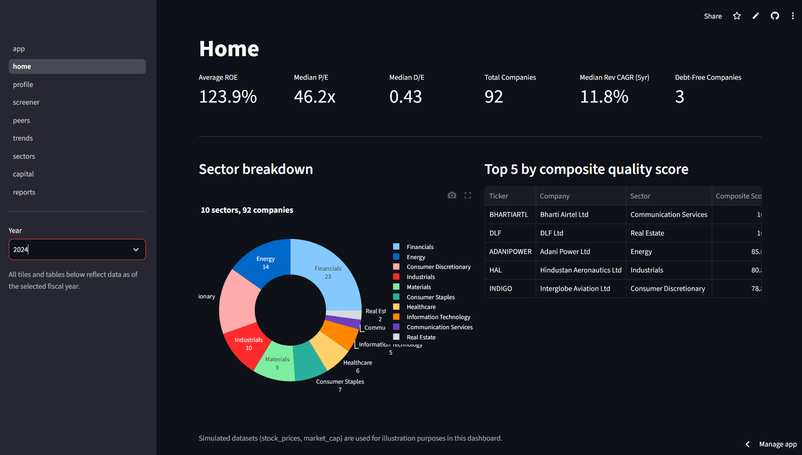
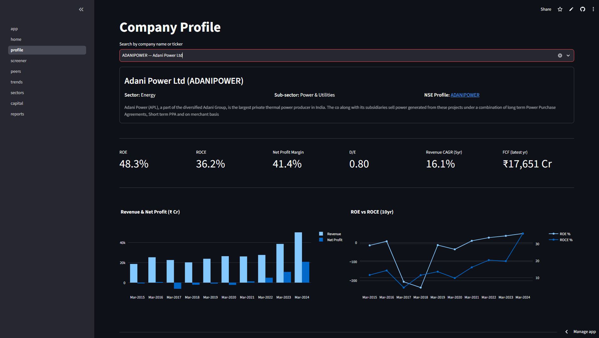
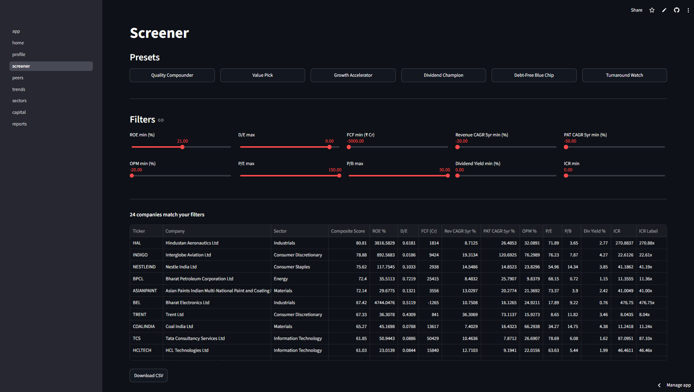
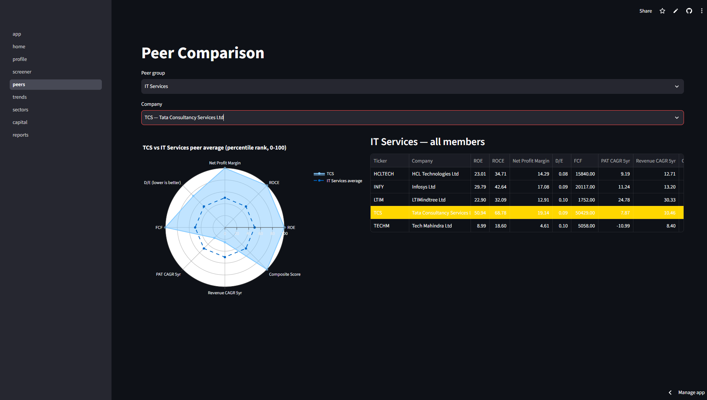
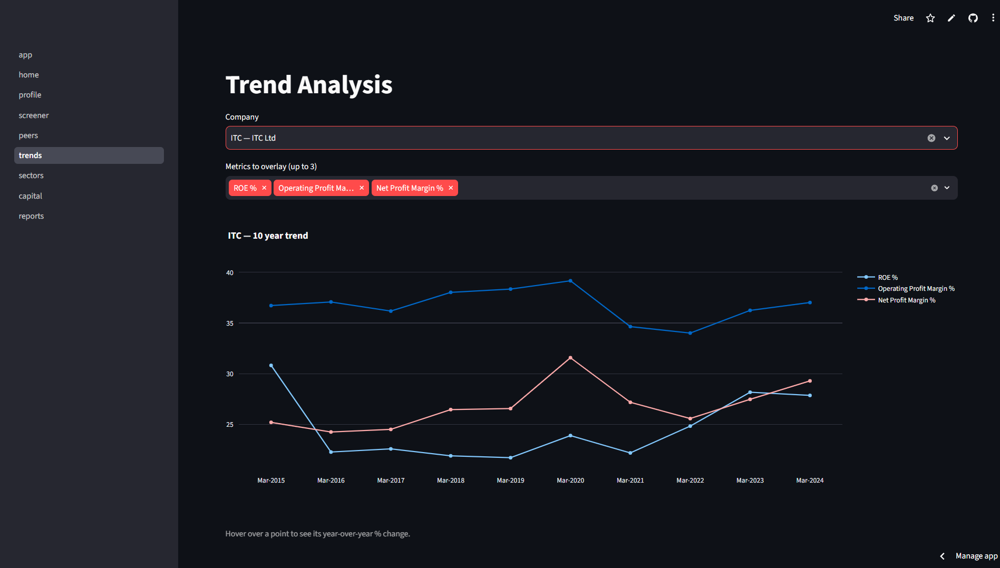
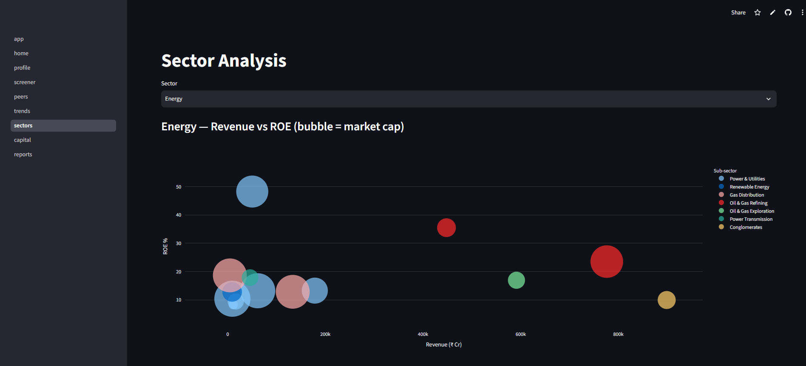
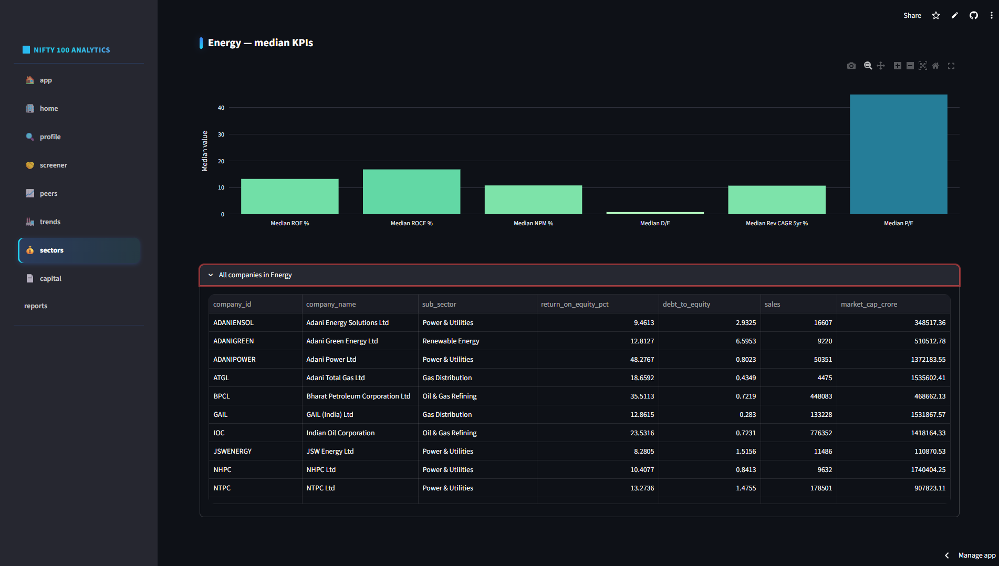
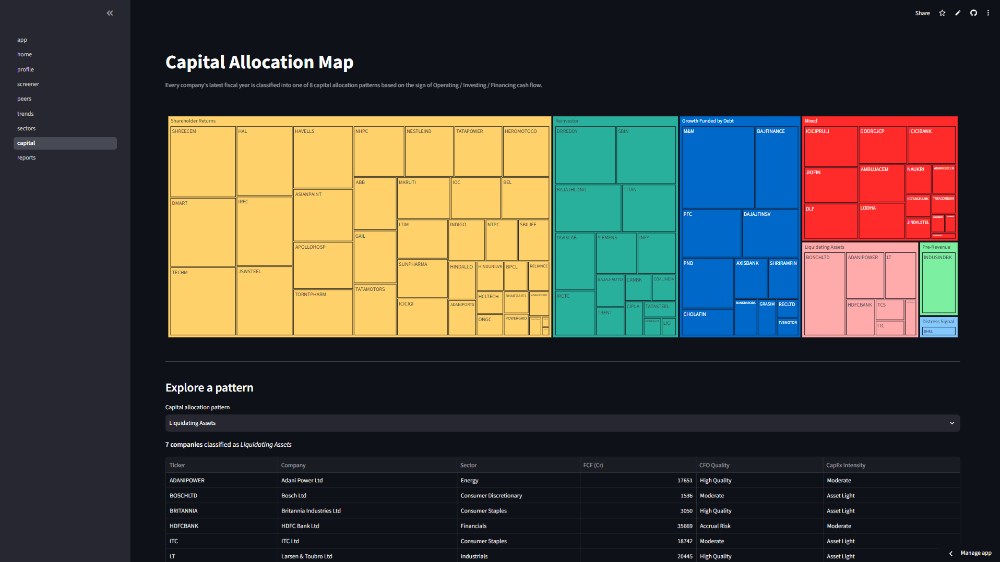
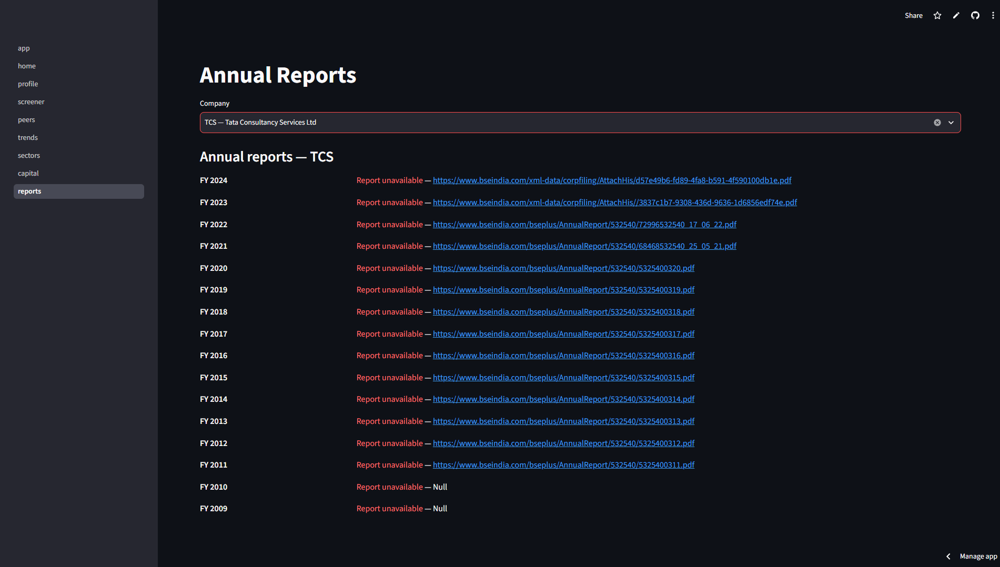

# 📊 Nifty 100 Financial Analytics Platform

<div align="center">


**AI-Powered Financial Analytics Platform for Nifty 100 Companies**

Built as an AI & Data Analytics Capstone Project during the Bluestock Fintech Internship.

</div>

---

# 🚀 Project Overview

The **Nifty 100 Financial Analytics Platform** is an end-to-end financial analytics application designed to analyze companies in the Nifty 100 index.

The project automates the complete pipeline from raw financial statement ingestion to interactive dashboards, valuation analytics, investment screeners, peer comparison, NLP-generated insights, clustering, PDF report generation, and REST APIs.

The platform processes financial data for **92 Nifty 100 companies** and provides professional-grade analytics useful for investors, analysts, and students.


---

# 📸 Dashboard Preview

## Home Dashboard



---

## Company Profile



---

## Stock Screener



---

## Peer Comparison



---

## Trend Analysis



---

## Sector Analysis





---

## Capital Allocation



---

## Annual Reports



---

# 📂 Project Structure

```text
Nifty100-Financial-Analytics
│
├── config/
├── data/
├── db/
├── docs/
├── notebooks/
├── output/
├── reports/
├── screenshots/
├── scripts/
├── src/
│   ├── analytics/
│   ├── api/
│   ├── dashboard/
│   ├── etl/
│   ├── nlp/
│   ├── reports/
│   └── screener/
│
├── tests/
│
├── nifty100.db
├── requirements.txt
├── Makefile
└── README.md
```

---

# 🛠 Tech Stack

### Programming

- Python

### Data Engineering

- Pandas
- NumPy
- SQLite
- SQLAlchemy

### Visualization

- Plotly
- Matplotlib
- Streamlit

### Machine Learning

- Scikit-Learn

### Backend

- FastAPI
- Uvicorn

### Reports

- ReportLab
- OpenPyXL

### Testing

- PyTest

---


## Quick Start — full pipeline, Sprint 1 → 6, from scratch

This project ships with `nifty100.db` and everything in `output/` /
`reports/` already pre-built, so most people can skip straight to
"Just run what's already built" below. If you want to regenerate
everything from the raw Excel files in `data/`, run every step below
**in this exact order** — several later steps read tables/files written
by earlier ones (most importantly: `src/analytics/ratios.py` must run
before anything else in Sprint 2+, since it's what actually populates
the `financial_ratios` table that the screener, peer engine, dashboard,
reports, clustering, and API all depend on).

```bash
python -m venv venv && source venv/bin/activate   # Windows: venv\Scripts\activate
pip install -r requirements.txt

# ── Sprint 1 — Data Foundation ──────────────────────────────────────
python src/etl/loader.py
# -> nifty100.db (schema + 10 tables), output/load_audit.csv,
#    output/validation_failures.csv

# ── Sprint 2 — Financial Ratio Engine ───────────────────────────────
python src/analytics/ratios.py
# -> financial_ratios table populated (1,164 rows), output/capital_allocation.csv,
#    output/ratio_edge_cases.log
python src/etl/load_market_cap.py
# -> market_cap table (552 rows)
python src/analytics/composite_score.py
# -> composite_quality_score (sector-relative v2) written into financial_ratios

# ── Sprint 3 — Screener & Peer Comparison ───────────────────────────
python src/screener/export_screener.py
# -> output/screener_output.xlsx (6 presets)
python src/analytics/peer.py
# -> peer_percentiles table (11 groups)
python src/analytics/radar.py
# -> reports/radar_charts/ (92 PNGs)
python src/screener/export_peer_comparison.py
# -> output/peer_comparison.xlsx (11 sheets)

# ── Sprint 4 — Dashboard & Valuation ────────────────────────────────
python src/analytics/valuation.py
# -> output/valuation_summary.xlsx, output/valuation_flags.csv
streamlit run src/dashboard/app.py
# -> http://localhost:8501 (Ctrl+C to stop, then continue below)

# ── Sprint 5 — NLP, Cash Flow Intelligence, PDF Reports ─────────────
python src/nlp/parser.py
# -> output/analysis_parsed.csv, output/parse_failures.csv
python src/nlp/pros_cons_generator.py
# -> output/pros_cons_generated.csv (92 companies, >=1 pro/con each)
python src/analytics/cashflow_intelligence.py
# -> output/cashflow_intelligence.xlsx, output/distress_alerts.csv
python src/reports/tearsheet.py
# -> reports/tearsheets/ (91-92 PDFs — JIOFIN skipped, <3yr data)
python src/reports/sector_report.py
# -> reports/sector/ (10 PDFs, one per broad sector in this dataset)
python src/reports/portfolio_summary.py
# -> reports/portfolio/portfolio_summary.pdf

# ── Sprint 6 — Clustering, API, Testing, Docs ───────────────────────
python src/analytics/clustering.py
# -> output/cluster_labels.csv, reports/elbow_plot.png
python src/analytics/cluster_profiling.py
# -> reports/correlation_heatmap.png, output/outlier_report.csv, output/portfolio_stats.csv
python -m src.reports.analyst_guide
# -> docs/analyst_guide.pdf (10 pages)
python scripts/gen_openapi.py
# -> docs/openapi.json, docs/postman_collection.json
pytest tests/ --html=reports/pytest_report.html --self-contained-html -v
# -> 172 tests, all passing
uvicorn src.api.main:app --reload --port 8000
# -> http://localhost:8000/docs (Ctrl+C to stop)
```

If you have GNU Make installed (Linux/macOS, or Windows via
`choco install make`), the same steps are available as `make load`,
`make ratios`, `make screener`, `make peers`, `make valuation`,
`make dashboard`, `make report`, `make cluster`, `make docs`, `make test`,
`make api` (see `Makefile` — each target is the exact commands above).

### Just run what's already built (recommended for most people)

```bash
python -m venv venv && source venv/bin/activate
pip install -r requirements.txt
pytest tests/ -v          # confirm 172/172 pass against the shipped nifty100.db
streamlit run src/dashboard/app.py    # or: uvicorn src.api.main:app --port 8000
```

## Sprint 1 — Data Foundation (COMPLETE)

Status: **done**. `nifty100.db` is built and validated from the 12 source
Excel files in `data/`.

### Run it

```bash
python -m venv venv && source venv/bin/activate
pip install -r requirements.txt

make load   # runs src/etl/loader.py -> builds nifty100.db, output/load_audit.csv,
            # output/validation_failures.csv
make test   # runs the ETL test suite (46 tests)
```

### What got built

| File | Purpose |
|---|---|
| `db/schema.sql` | 10-table SQLite schema (companies, profitandloss, balancesheet, cashflow, analysis, documents, prosandcons, sectors, stock_prices, peer_groups) |
| `src/etl/normaliser.py` | `normalize_ticker()`, `normalize_year()` — see module docstring for the 5 raw period formats handled |
| `src/etl/validator.py` | All 16 DQ rules (DQ-01 .. DQ-16) |
| `src/etl/loader.py` | Loads all 12 source files, runs DQ rules, excludes CRITICAL rows, populates `nifty100.db` |
| `tests/etl/test_normalise.py` | 36 tests (20 year-parsing cases + 15 ticker cases + 1 extra) |
| `tests/etl/test_loader.py` | 10 tests on source-file row counts / columns |
| `notebooks/exploratory_queries.sql` | 10 sanity queries |

### Why `market_cap.xlsx` and the source `financial_ratios.xlsx` aren't loaded here

The project brief lists **10 tables** built from **12 source files**. The 7
core files (companies, P&L, balance sheet, cash flow, analysis, documents,
pros/cons) plus sectors, stock_prices, and peer_groups make exactly 10.
`market_cap.xlsx` is used later for Sprint 4 valuation, and the source
`financial_ratios.xlsx` is a pre-computed reference file used in Sprint 2 to
cross-check the ratio engine's own output (Day 13) — it is not raw
transactional data that belongs in this base schema.

### Data quality findings from the actual data (Day 06 manual review)

Real issues the validator caught, not synthetic examples:

- **8 tickers appear in P&L/balance sheet/cash flow but have no row in
  `companies.xlsx`**: `ULTRACEMCO`, `ZOMATO`, `VBL`, `VEDL`, `UNITDSPR`,
  `ZYDUSLIFE`, `WIPRO`, `UNIONBANK`. These are excluded from the load
  (DQ-03, CRITICAL) and logged in `validation_failures.csv` — there's no way
  to fix this without adding those companies' master records, which is a
  data-sourcing gap to flag to the team lead, not a loader bug.
- **Duplicate (company_id, year) rows** in several tables — some companies
  have both a `'Mon YYYY'` row and a separate `'YYYY'`-only row for what
  looks like the same fiscal year (different data vintages). The loader
  keeps the first occurrence and logs the rest (DQ-02, CRITICAL).
- **JIOFIN** has only 3 years of P&L history (recent IPO) — expected, not a
  bug.
- Malformed period strings like `'Mar 2023 15'` and `'Mar 2016 9m'` parse
  fine once the trailing token is stripped (logged as WARNING, not
  excluded).

### Exit criteria — verified

- [x] `SELECT COUNT(*) FROM companies` = 92
- [x] `PRAGMA foreign_key_check` → 0 rows
- [x] `load_audit.csv` shows per-table read/loaded/rejected counts with reasons
- [x] 46 ETL unit tests pass (spec required 35+)
- [x] Manual review of 5 random companies — row counts sane, no surprises
- [ ] Sprint review sign-off — pending team lead demo

## Sprint 4 — Streamlit Dashboard + Valuation (COMPLETE)

Status: **done**. An 8-screen Streamlit dashboard on top of `nifty100.db`,
plus a valuation module that flags every company as Fair / Caution /
Discount relative to its sector.

### Run it

```bash
make valuation   # runs src/analytics/valuation.py -> output/valuation_summary.xlsx,
                 # output/valuation_flags.csv
make dashboard   # streamlit run src/dashboard/app.py -> http://localhost:8501
```

### What got built

| File | Purpose |
|---|---|
| `src/dashboard/app.py` | Entry point — page config + landing screen. Streamlit auto-builds the sidebar nav from `src/dashboard/pages/` |
| `src/dashboard/pages/01_home.py` | 6 KPI tiles, sector donut chart, top-5 by composite score, year selector (2019-2024) |
| `src/dashboard/pages/02_profile.py` | Company search, company card, 6 KPI tiles, 10yr Revenue/Net Profit bars, ROE/ROCE dual-axis line, pros & cons badges |
| `src/dashboard/pages/03_screener.py` | 10 metric sliders, 6 preset buttons, live-updating results table, CSV download |
| `src/dashboard/pages/04_peers.py` | Peer group dropdown, 8-axis radar chart vs peer average, side-by-side KPI table with benchmark row highlighted |
| `src/dashboard/pages/05_trends.py` | Company search + up to 3 overlaid metrics, 10yr line chart with YoY annotations |
| `src/dashboard/pages/06_sectors.py` | Sector dropdown, Revenue/ROE/Market-Cap bubble chart, sector median KPI bars |
| `src/dashboard/pages/07_capital.py` | Treemap of all 92 companies by 8 capital allocation patterns, with a drill-down company list |
| `src/dashboard/pages/08_reports.py` | Annual report links per company, with a live link-validity check ("Report unavailable" badge on failure) |
| `src/dashboard/utils/db.py` | Cached (`@st.cache_data(ttl=600)`) data loaders shared by every screen |
| `src/analytics/valuation.py` | FCF yield, sector-median P/E, Fair/Caution/Discount flag, `output/valuation_summary.xlsx` + `output/valuation_flags.csv` |

### Design notes / assumptions

- Every screen that needs "one row per company" reuses
  `src/screener/universe.py::build_universe()` (Sprint 3) so the Home,
  Screener, Sector, and Peer screens never disagree on a number.
- The Home screen's year selector needed a variant of the universe pinned
  to an arbitrary calendar year rather than always "latest" — that's
  `get_universe_for_year()` in `db.py`, used only there.
- `market_cap.xlsx` values (P/E, P/B, market cap, dividend yield) are
  **simulated data**, per the project's stated data-labelling rule — this
  is called out in the dashboard footer.
- The Annual Reports screen's link check makes a live HTTP HEAD request
  with a 5s timeout; any failure (network, timeout, 4xx/5xx) shows
  "Report unavailable" rather than a dead link.

### Exit criteria — verified

- [x] `output/valuation_summary.xlsx` has 92 rows with all required columns
- [x] All 6 screener presets + all 8 dashboard screens run against the real
      `nifty100.db` without exceptions (smoke-tested against mocked
      Streamlit/Plotly, since this sandbox has no network to install them —
      **install `streamlit`/`plotly` from `requirements.txt` and run
      `make dashboard` to verify interactively before sign-off**)
- [ ] Company Profile screen load time < 3s — needs verifying on your
      machine (couldn't be measured in this sandbox)
- [ ] Sprint review sign-off — pending team lead demo

## Roadmap (Sprints 2-6)

| Sprint | Focus |
|---|---|
| 2 | Financial Ratio Engine (50+ KPIs, CAGR engine, cash flow KPIs) — COMPLETE |
| 3 | Screener (6 presets) + Peer percentile engine — COMPLETE |
| 4 | Streamlit dashboard (8 screens) + Valuation module — COMPLETE |
| 5 | NLP pros/cons generator + Cash Flow Intelligence + PDF tearsheets |
| 6 | KMeans clustering + FastAPI (16 endpoints) + full test suite + sign-off |

See `Makefile` for the command that will exist for each stage.

---

# 📊 Generated Outputs

The project automatically generates

- SQLite Database
- Financial Ratio Table
- Screener Reports
- Peer Comparison Reports
- Radar Charts
- PDF Tear Sheets
- Sector Reports
- Portfolio Summary
- Cluster Labels
- Correlation Heatmap
- Analyst Guide
- OpenAPI Documentation

---

# 👨‍💻 Author

**Utsav Ratapiya**

B.Tech Computer Science (AI & ML)

Adani University

GitHub

https://github.com/Utsav-Ratpiya

LinkedIn

https://www.linkedin.com/in/utsav-ratapiya-2b9470284/

---

# ⭐ If you found this project useful

Please consider giving this repository a ⭐ on GitHub.

---

## 📜 License

This project is developed for educational and internship purposes.